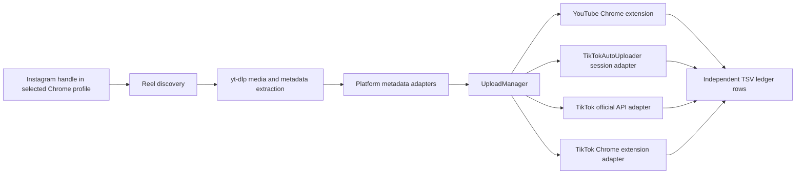

# Social Reel Bridge

A local, account-agnostic harness that reads Instagram Reels, downloads each video with a configurable unofficial downloader, and publishes it to independently configured TikTok and/or YouTube accounts. YouTube keeps its existing Chrome-extension workflow. TikTok can use the Chrome extension, the official Content Posting API, or the session-based HTTP uploader from `makiisthenes/TiktokAutoUploader`.

## Purpose and MVP capabilities

Social Reel Bridge is intended for creators transferring Reels they own from an Instagram profile to their own YouTube and TikTok accounts. The current MVP provides:

- discovery of the accessible Reels visible to the signed-in Instagram session in the current Chrome profile;
- direct Reel media and metadata extraction through `yt-dlp`, with an authenticated Chrome-cookie fallback;
- YouTube-only, TikTok-only, or concurrent YouTube + TikTok dispatch;
- independent account aliases, public handles, authentication methods, metadata adapters, upload results, and retry state per platform;
- exact Instagram caption preservation, with YouTube-safe title mapping;
- a manually editable TSV ledger that prevents redispatch after confirmed destination success;
- deletion of downloaded media after YouTube and every selected destination confirm completion;
- offline unit and process-boundary tests that do not contact production accounts.

The harness is a local CLI and Chrome extension, not a hosted service. It does not scrape private content the configured Instagram session cannot access and does not bypass platform authentication, CAPTCHA, copyright, or account-warning screens.

## Architecture and workflow



The `UploadManager` starts selected destination adapters concurrently for one Reel. It waits for every result before advancing to the next Reel. Each adapter writes only its own destination status, so one platform failure does not cancel or overwrite another platform's success.

## Technology stack

- Node.js 20+ using ECMAScript modules and the built-in Node test runner
- Chrome Manifest V3 extension for current-session discovery and browser uploads
- Playwright as the optional direct-browser fallback
- `yt-dlp` for Instagram extraction and media download
- Python 3.9+ for deep Instagram discovery and the optional TikTokAutoUploader bridge
- GitHub Actions for syntax checks, unit tests, process-boundary tests, and Python compilation

## Project structure

```text
extension/                   Chrome MV3 discovery/upload extension
patches/                     Pinned upstream compatibility patches
scripts/                     Installer, Python bridges, and validation tools
src/
  upload-manager.js          Concurrent platform orchestration
  uploaders/                 YouTube and TikTok adapters
  cli.js                     setup, transfer, sync, and ledger commands
state/                       Local editable ledger (ignored)
downloads/                   Temporary downloaded media (ignored)
test/                        Offline unit and process-boundary tests
config.example.json          Secret-free account/configuration template
```

## Install the Chrome extension (recommended uploader)

1. Open the Google Chrome profile you want the harness to use.
2. Navigate to `chrome://extensions`.
3. Enable **Developer mode**.
4. Choose **Load unpacked**.
5. Select the project's `extension` folder.
6. Pin **Social Reel Bridge** to the Chrome toolbar.
7. Open the extension, enter the logical profile alias assigned to this profile in `config.json` (for example, `personal`), and choose **Save and check for upload**.

After pulling an extension update, return to `chrome://extensions` and choose **Reload** for Social Reel Bridge in each configured Chrome profile.

Repeat these steps in every Chrome profile you want to make selectable, using a unique logical alias in each extension popup. With `defaults.uploadMethod` set to `extension`, the local harness never launches a destination browser. It sends each job only to the extension instance whose saved alias matches the selected profile. The harness listens only on `127.0.0.1:43117`, serves the current video to the extension, and stops the server when the run finishes. If Chrome does not open an upload tab within 30 seconds, open the selected profile, click the extension icon, and choose **Save and check for upload**.

With `defaults.instagramDiscoveryMethod` set to `extension`, profile discovery runs in the selected Chrome profile. The extension opens the Instagram Reels page, uses that profile's existing Instagram login, scrolls the page, and returns canonical Reel URLs to the harness. No separate Playwright Chrome profile is opened for discovery.

Define logical aliases and their corresponding Chrome profile directories in `config.json`:

```json
{
  "chromeProfiles": {
    "personal": { "label": "Personal browser", "profileDirectory": "Default" },
    "work": { "label": "Work browser", "profileDirectory": "Profile 2" }
  },
  "defaults": {
    "chromeProfile": "personal"
  }
}
```

`chromeProfile` is the logical alias stored by the extension and selected by the harness. `profileDirectory` is Chrome's on-disk directory name and is used only by cookie extraction and the optional direct-browser fallback. Find the current directory at `chrome://version` under **Profile Path**; use only its final directory component, such as `Default` or `Profile 2`.

Override the default for any `setup`, `transfer`, or `sync` run:

```powershell
node src/cli.js sync --handle "@source_handle" --youtube yt-main --chrome-profile work --mode publish
```

The extension does not switch Chrome profiles itself. The matching Chrome profile must be open, have the unpacked extension installed, and have the same logical alias saved in its extension popup. Other profiles can remain open; they will not claim a job addressed to `work`.

The extension uses TikTok's ordinary file-change flow for compatibility with TikTok Studio. For YouTube, it uses Chrome's `debugger` permission only long enough to assign the downloaded local MP4 to YouTube's native hidden file input, then immediately detaches. Chrome may briefly display a developer-tools control banner during YouTube file assignment.

In `publish` mode, the upload manager starts the configured TikTok and YouTube adapters concurrently for each Reel. The harness waits for both destination results before moving to the next Reel. In `draft` mode, Chrome-extension fields are populated but require review confirmation; the official TikTok API and TikTokAutoUploader adapters support publish mode only.

## TikTokAutoUploader integration

The optional `tiktok-auto-uploader` adapter invokes the immediate-upload and locally stored session functionality from [makiisthenes/TiktokAutoUploader](https://github.com/makiisthenes/TiktokAutoUploader), pinned to revision `d29b4366edf0de705e87f265298a06b64a00d7dc`. It uses HTTP requests for publishing and does not depend on TikTok Studio page selectors. The external scheduler, API service, database, web UI, and video-generation pipeline are not integrated.

TikTokAutoUploader is unofficial and uses TikTok web endpoints. TikTok can change or reject those endpoints, expire a stored session, rate-limit an account, or take action against automated use. Use it only for accounts and media you control. Its session cookies are credentials and must not be shared.

YouTube and TikTok accounts remain separate even when both public handles are the same:

```json
{
  "accounts": {
    "youtube": {
      "yt-main": { "handle": "@creator_handle", "label": "Main YouTube channel" }
    },
    "tiktok": {
      "tt-main": {
        "handle": "@creator_handle",
        "label": "Main TikTok profile",
        "uploadMethod": "tiktok-auto-uploader",
        "sessionName": "creator-tiktok",
        "uploaderPath": ".vendor/TiktokAutoUploader",
        "pythonCommand": "python"
      }
    }
  }
}
```

`yt-main` and `tt-main` are local aliases. `handle` is the public account name used in logs. TikTok's `sessionName` selects its local cookie file and can differ from the handle. Different handles such as YouTube `@youtube_account` and TikTok `@tiktok_account` work without pipeline changes.

## Mapping

| Instagram Reel | TikTok | YouTube |
|---|---|---|
| Exact caption, including line breaks, mentions, hashtags, and emoji | Caption | Description |
| Complete caption | — | Title (Unicode-safe, truncated only at YouTube's 100-character limit) |
| Hashtags | Remain in caption | Remain in description and are extracted as video tags |
| Video | Video upload | Video upload; YouTube determines Shorts eligibility |

Platform-only objects such as Instagram collaborators, locations, product tags, stickers, and licensed-audio attribution cannot be transferred as equivalent objects.

## Install

1. Install [Node.js](https://nodejs.org/) 20 or newer, Python 3.9 or newer, Git, Google Chrome, and [`yt-dlp`](https://github.com/yt-dlp/yt-dlp). On Windows: `winget install yt-dlp.yt-dlp`.
2. Run `npm.cmd install`.
3. Run `npx.cmd playwright install chromium` if Chrome is not already installed.
4. Copy `config.example.json` to `config.json` and edit the account IDs and labels. IDs are local aliases, not usernames.
5. To use the HTTP-based TikTok adapter, run `npm.cmd run install:tiktok-uploader`. Set `TIKTOK_PYTHON` to a Python 3.9+ executable first if `python` points to an older installation. The adapter also honors this variable at upload/login time; alternatively set the same executable as the account's `pythonCommand`.

The default downloader is `yt-dlp`. It is intentionally isolated behind `src/downloader.js`, so a different command or provider adapter can replace it without changing account or upload logic. Never enter an Instagram password into a third-party downloader.

### Environment variables and credentials

`.env.example` documents supported variable names, but this Node application reads the process environment and does not automatically load the root `.env` file. Set values in the current shell or a secret manager:

```powershell
$env:TIKTOK_ACCESS_TOKEN = "official-api-user-token"
$env:TIKTOK_PYTHON = "C:\Path\To\Python312\python.exe"
$env:TIKTOK_PROXY_URL = "http://proxy.example:8080"
```

Only `TIKTOK_ACCESS_TOKEN` is required for a TikTok account using `"uploadMethod": "api"`. `TIKTOK_PYTHON` selects the Python executable for installation, login, and upload. A proxy variable is read only when its variable name is configured through the account's `proxyEnv`; the proxy value itself must not appear in `config.json`.

## Store destination account sessions

### TikTokAutoUploader session

After installing the upstream uploader and configuring a TikTok alias with `"uploadMethod": "tiktok-auto-uploader"`, save that alias's TikTok session:

```powershell
npm.cmd run setup -- --platform tiktok --account tt-main
```

The upstream login opens Chrome once. Sign into the TikTok profile corresponding to the configured `handle`. The session is saved as `.vendor/TiktokAutoUploader/CookiesDir/tiktok_session-<sessionName>.cookie`. The cookie file, `.vendor/`, `.env`, and `CookiesDir/` are ignored by Git. The harness never prints cookie contents.

Every TikTok alias has its own `sessionName`; run setup once for each alias. If the upload reports an expired or missing session, remove only that alias's cookie file and rerun setup.

### Chrome extension and direct-browser sessions

With `defaults.uploadMethod` set to `extension`, the extension uses the TikTok and YouTube accounts already signed into the selected Chrome profile. Destination aliases and `handle` values control configuration, logging, and ledger identity; selecting a Chrome profile routes the browser job but does not cryptographically verify the active YouTube/TikTok web account. Confirm the visible account in each configured profile before unattended publishing.

The optional direct Playwright fallback uses separate persistent sessions and can be initialized with:

```powershell
npm.cmd run setup -- --platform tiktok --account tt-main
npm.cmd run setup -- --platform youtube --account yt-main
```

Those fallback sessions are stored under `.sessions/` and ignored by Git. They are not used by the current-session Chrome extension or by TikTokAutoUploader.

## Transfer

### TikTok official API

TikTok accounts with `"uploadMethod": "api"` use the official Content Posting API instead of Chrome. Create a TikTok developer app, add the Content Posting API product, obtain approval for the `video.publish` scope, authorize the destination account, and place its user access token in the environment variable configured by `accessTokenEnv`:

```powershell
$env:TIKTOK_ACCESS_TOKEN = "your-user-access-token"
```

The adapter queries the creator's current privacy options, initializes a `FILE_UPLOAD`, sends the local MP4 in compliant chunks, and waits for `PUBLISH_COMPLETE`. The example uses `SELF_ONLY`, which is required for unaudited clients. Access tokens expire and must be refreshed using TikTok's OAuth token endpoint. Never save the token or client secret in `config.json`.

### TikTokAutoUploader account options

| Setting | Meaning | Default |
|---|---|---|
| `visibility` | Upstream visibility value (`0` public, `1` private) | `0` |
| `allowComment` | Allow comments | `true` |
| `allowDuet` | Allow duets | `false` |
| `allowStitch` | Allow stitches | `false` |
| `proxyEnv` | Name of an environment variable containing a proxy URL | unset |
| `timeoutMs` | Per-upload process timeout | 10 minutes |

Proxy values and session contents belong in environment variables or ignored session files, never `config.json`.

Publish one Reel through the configured destination adapters:

```powershell
npm.cmd run run -- --reel "https://www.instagram.com/reel/REEL_ID/" --tiktok tt-main --youtube yt-main --mode publish
```

Choose any configured source and destination aliases. Omit `--tiktok` or `--youtube` to send to only one platform. `--mode draft` is available only to Chrome-extension accounts; the official TikTok API and TikTokAutoUploader require `--mode publish`.

YouTube only:

```powershell
node src/cli.js sync --handle "@source_handle" --instagram ig-source --youtube yt-main --platforms youtube --mode publish
```

TikTokAutoUploader only:

```powershell
node src/cli.js sync --handle "@source_handle" --instagram ig-source --tiktok tt-main --platforms tiktok --mode publish
```

YouTube and TikTok concurrently for each Reel:

```powershell
node src/cli.js sync --handle "@source_handle" --instagram ig-source --youtube yt-main --tiktok tt-main --platforms youtube,tiktok --mode publish
```

The upload manager starts both selected adapters concurrently. It waits for both results before moving to the next Reel, but a TikTok failure does not cancel a YouTube upload and a YouTube failure does not erase a successful TikTok result. Each result is recorded in its own ledger row. A downloaded file is deleted only after YouTube and every selected destination have completed successfully.

## State, errors, retries, and cleanup

The harness records each source/destination combination in the Notepad-friendly `state/ledger.tsv`. Only a destination whose `status` column is `completed` is skipped. `started`, `retry`, `failed`, and `needs_review` destinations are retried on the next run. A Reel advances to the next discovered Reel only after every selected destination has confirmed completion.

With `defaults.deleteAfterYouTubeUpload` enabled, the downloaded MP4 is deleted after YouTube is confirmed and every destination selected for that Reel has completed. If another selected destination fails, the file is retained for retry. The ledger keeps the canonical Reel ID, URL, platform, and account records after deletion, so completed destinations are skipped before any later download or upload.

Open the ledger with `node src/cli.js ledger`. To manually skip one destination, change its status to `completed`. To unskip it, change the status to `retry`. Save and close Notepad before running the harness. Each Reel has separate TikTok and YouTube rows, so either platform can be controlled independently. Do not change the identifiers or URL columns unless intentionally creating a new tracking entry.

## Synchronize every Reel from a handle

The `sync` command scrolls through the handle's Reels page, collects every Reel accessible to the selected Instagram session, canonicalizes the URLs, and processes only missing source/destination combinations:

```powershell
node src/cli.js sync --handle "@myhandle" --tiktok tt-main --youtube yt-main --mode publish
```

Use `--max 10` to process at most ten discovered Reels during a test run. Run the same command again at any time: only confirmed `completed` destinations are skipped. Interrupted, failed, and review-required rows are retried independently. For example, a Reel previously completed on `tt-main` will not be sent there twice, but it can still be sent later to a newly selected YouTube account.

Use `--platforms youtube` or `--platforms tiktok` to temporarily enable only one destination even when both account aliases are present. Use `--platforms tiktok,youtube` for both. The persistent default is controlled by `defaults.enabledPlatforms` in `config.json`.

If the process is interrupted or an uploader errors, that destination is retried on the next run. Because browser pages cannot provide true idempotency keys, a platform that publishes successfully but fails to show a recognizable confirmation could be retried; check account history if that unusual case occurs.

With the default `instagramDiscoveryMethod: "extension"`, discovery uses the selected Chrome profile and its existing Instagram session. In direct-browser fallback mode, omitting `--instagram` and profile selection uses a temporary logged-out browser; private or login-blocked sources then require a configured Instagram alias or a selected Chrome profile.

The temporary fallback discovery browser runs headlessly and is not shown. Chrome-extension uploads use the already-running selected Chrome profile; direct Playwright uploads use sessions stored beneath `.sessions/`, including one-time automation copies of explicitly selected Chrome directories.

Deep discovery uses Instaloader profile pagination before falling back to the visible Instagram grid. Install it with `python -m pip install instaloader`. This allows discovery beyond the 12-tile logged-out preview when Instagram permits anonymous pagination. If Instagram rate-limits anonymous pagination, the harness now fails explicitly instead of incorrectly treating 12 Reels as the complete profile. A later retry, an authenticated Instagram source session, or a configured third-party discovery provider may still be required because the harness cannot override Instagram's server-side access limit.

## Operational notes

- Browser upload pages change; selectors may occasionally need maintenance.
- CAPTCHA, two-factor prompts, copyright screens, and account warnings deliberately require human handling.
- TikTok caption limits can vary by account. The harness preserves the exact caption and lets the platform report if it exceeds the destination limit; it does not silently truncate it.
- Instagram music licensing does not automatically carry to TikTok or YouTube.
- Use only media you own and comply with each platform's terms.

## Known MVP limitations

- Chrome-profile aliases route extension jobs but do not switch or verify the active YouTube/TikTok website account inside that profile; the signed-in web account is authoritative.
- Instagram, TikTok, and YouTube page structures and unofficial web endpoints can change without notice.
- A platform may accept a post but fail to show a recognizable confirmation. In that ambiguous case the ledger remains retryable; check platform history before rerunning to avoid a duplicate.
- TikTokAutoUploader immediate uploads require Python 3.9+, its pinned dependencies, its signature Chromium, and a locally saved TikTok session.
- Official TikTok API uploads require an approved application, `video.publish`, and manual token refresh outside this MVP.
- Platform-native collaborators, licensed-audio rights, location/product objects, thumbnails, playlists, and advanced scheduling are not mapped automatically.
- Real-account integration tests are deliberately not part of CI because they would publish content and require secrets.

## Security considerations

- `config.json`, `.env`, `.vendor/`, `.sessions/`, cookies, downloaded media, state, logs, Python caches, and coverage output are ignored by Git.
- Store access tokens and proxies in environment variables or a secret manager. Never put their values in account configuration or command history.
- TikTokAutoUploader cookie files grant account access. Protect them like passwords and remove an individual cookie when revoking that local session.
- The extension requests `tabs`, `storage`, and `debugger` permissions. It attaches the debugger only long enough to assign a local file to YouTube's native input, then detaches.
- The harness bridge listens only on `127.0.0.1:43117` while a run is active. Do not expose that port through a proxy or tunnel.
- Download and publish only media you own or are authorized to redistribute.

## TikTokAutoUploader troubleshooting

- **Python rejected during installation:** upstream requires Python 3.9+. Install a newer Python and set `$env:TIKTOK_PYTHON` to its executable before running `npm.cmd run install:tiktok-uploader`.
- **Uploader not installed:** run `npm.cmd run install:tiktok-uploader`. The installer verifies the pinned upstream revision instead of silently using a different checkout.
- **Session cookie missing or expired:** rerun `npm.cmd run setup -- --platform tiktok --account tt-main` for that exact alias.
- **Dependency/import failure:** rerun the installer using the same Python executable configured as `pythonCommand`.
- **Signature/Chromium failure:** from `.vendor/TiktokAutoUploader/tiktok_uploader/tiktok-signature`, run `npm.cmd install` and `npx.cmd playwright install chromium`.
- **TikTok rejects the upload:** the ledger keeps TikTok in `needs_review` while retaining an independently successful YouTube result. Review the platform-aware terminal error before retrying.
- **Unsupported video:** the adapter accepts MP4, MOV, and WEBM files and rejects missing or unsupported inputs before starting an external process.

## Tests

Run syntax checks and the complete offline suite with:

```powershell
npm.cmd run verify
```

Tests mock the YouTube and TikTok network boundaries; they never publish production videos. A process-boundary smoke test launches the actual Node-to-Python adapter against a temporary fake upstream module. Coverage includes YouTube-only, TikTok-only, concurrent dual-platform execution, same and different account handles, metadata routing, session validation, malformed files, duplicate prevention, and independent failure/results tracking. Real-account validation is an optional manual step after installing the pinned upstream uploader and saving a TikTok session.

## Contributing and development

1. Create a focused feature branch from `main`.
2. Keep platform network calls behind uploader adapters and inject fakes in automated tests.
3. Add or update tests before changing behavior.
4. Run `npm.cmd run verify` and compile both Python scripts before opening a pull request.
5. Never add real account identifiers, cookies, downloaded media, tokens, or session directories to fixtures.

## Planned improvements

- OAuth refresh-token management for the official TikTok API
- explicit verification/switching of the active YouTube channel in Chrome
- richer platform scheduling and visibility adapters
- stronger confirmation reconciliation against destination post history
- configurable rate limiting and resumable batch controls
- additional destination adapters using the existing upload-manager interface

## License

Social Reel Bridge is licensed under the [MIT License](LICENSE). Copyright © 2026 0x00C0DE.

Third-party components retain their own licenses. See [THIRD_PARTY_NOTICES.md](THIRD_PARTY_NOTICES.md) for attribution and the installed upstream license files for their complete terms.
